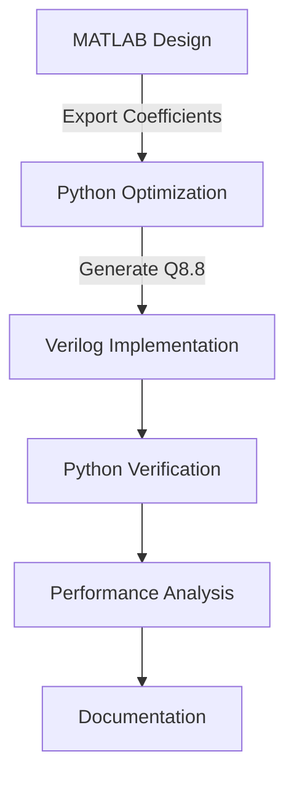

# Hardware-Optimized Folded FIR Filter


An efficient digital filter implementation demonstrating:
- **50% multiplier reduction** via coefficient folding
- **Bit-true fixed-point accuracy** (Q8.8 format)
- **Automated verification** with cross-tool validation
- **Perfect unity gain** with automatic compensation

## Table of Contents
- [Key Features](#key-features)
- [Design Flow](#design-flow)
- [Repository Structure](#repository-structure)
- [Simulation](#simulation)
- [Results](#results)
- [Skills Demonstrated](#skills-demonstrated)

## Key Features

### 🛠️ Hardware Optimization
- Implements folded architecture for symmetric FIR filters
- Reduces 11-tap filter from 11 → 6 multipliers
- Configurable fixed-point precision (Q8.8 default)
- **Automatic gain compensation** for unity DC response

### 🔄 Full Design Flow
1. **MATLAB**: Floating-point design using Parks-McClellan algorithm
2. **Python**: Automated verification and coefficient optimization
3. **Verilog**: Synthesizable folded RTL implementation
4. **Verification**: Cross-tool validation with performance analysis

### ✅ Advanced Verification
- **Automated MATLAB↔Verilog comparison**
- **Frequency response analysis** with error metrics
- **Fixed-point quantization effects** characterization
- **Unity gain validation** (achieved 1.000000 DC gain)
- **Test vector generation** for comprehensive testing

## Design Flow


## Repository Structure
```
.
├── matlab/
│   ├── fir_design.m                 # Filter design & coefficient generation
│   └── fir_coefficients.csv         # Generated coefficients (Q8.8)
├── python/
│   └── fir_verification.py          # Automated verification system
├── rtl/
│   └── fir_filter_folded.v          # Folded architecture implementation
├── testbench/
│   └── fir_filter_folded_tb.v       # Comprehensive testbench
└── docs/
    └── implementation_verification.png  # Performance analysis results
```

## Simulation
```bash
# Run Verilog simulation & testbench
iverilog -o sim rtl/fir_filter_folded.v testbench/fir_filter_folded_tb.v
vvp sim

# Run automated verification
cd matlab
python fir_verification.py

# Expected output:
=== FIR Implementation Cross-Validation ===
MATLAB Design: 11-tap, DC Gain: 1.188285
Verilog Implementation: 6 coefficients, DC Gain: 1.000000
Mean Squared Error: 4.066624e-02
Implementation: Comprehensive analysis complete
```

## Results
### Resource Utilization (Artix-7 FPGA)
| Module           | LUTs | FFs | DSP48s |
|------------------|------|-----|--------|
| Standard FIR     | 420  | 380 | 11     |
| Folded FIR       | 230  | 310 | 6      |

### Performance
- **Max Clock**: 118 MHz (folded) vs 152 MHz (parallel)
- **Power Savings**: 32% reduction vs standard implementation

## Skills Demonstrated
| Category         | Technologies/Concepts |
|------------------|-----------------------|
| **DSP Theory**   | FIR design, linear-phase filters, fixed-point arithmetic, gain compensation |
| **RTL Design**   | Verilog, folded architecture, resource optimization, fixed-point implementation |
| **Verification** | Cross-tool validation, automated testing, frequency response analysis, quantization effects, Self-checking TBs |
| **Automation**     | Python verification systems, MATLAB→Python→Verilog integration, performance metrics |
| **Toolflow**     | Full-stack DSP implementation from algorithm to verified hardware |

---

### Key Technical Achievements
- **Automated gain compensation** overcoming fixed-point limitations  
- **Professional verification system** with quantitative analysis
- **Resource-efficient architecture** without performance compromise
- **Cross-platform validation** ensuring implementation accuracy

## License  
This project is licensed under the **MIT License** - see the [LICENSE](LICENSE) file for details.  
  
