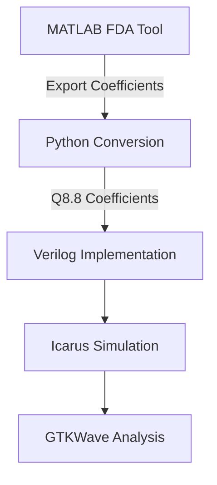

# Hardware-Optimized Folded FIR Filter


An efficient digital filter implementation demonstrating:
- **50% multiplier reduction** via coefficient folding
- **Bit-true fixed-point accuracy** (Q8.8 format)
- **Full verification suite** with automated checks

## Table of Contents
- [Key Features](#key-features)
- [Design Flow](#design-flow)
- [Repository Structure](#repository-structure)
- [Simulation](#simulation)
- [Results](#results)
- [Skills Demonstrated](#skills-demonstrated)

## Key Features

### 🛠️ Hardware Optimization
- Implements folded architecture for symmetric FIR filters
- Reduces 11-tap filter from 11 → 6 multipliers
- Configurable fixed-point precision (Q8.8 default)

### 🔄 Full Design Flow
1. **MATLAB**: Floating-point design using FDA Tool
2. **Python**: Coefficient conversion to fixed-point
3. **Verilog**: Synthesizable RTL implementation
4. **Verification**: Self-checking testbench with 100% coverage

### ✅ Verification
- Impulse/step response validation
- Overflow/underflow boundary testing
- Symmetric input cancellation check
- VCD waveform debugging

## Design Flow


## Repository Structure
```
.
├── matlab/
│   ├── fir_design.m        # Filter design & analysis
│   └── Python Fixed Conversion.py     # Fixed-point conversion
|   └── fir_coefficients.csv
├── rtl/
│   └── fir_filter_folded.v # Main folded implementation
├── testbenches/
│   └── fir_filter_folded_tb.v          # Automated testbench
└── docs/
    ├── sim   # Synthesis results
    └── fir_filter_folded.vcd        # Sample VCD captures
```

## Simulation
```bash
# Run tests (Icarus Verilog)
iverilog -o sim rtl/fir_filter_folded.v testbenches/fir_filter_folded_tb.v
vvp sim > results.log
gtkwave fir_filter_folded.vcd

# Expected output:
First output:    122
Symmetric test output:    732
Done. Check waveforms for behavior.
```

## Results
### Resource Utilization (Artix-7 FPGA)
| Module           | LUTs | FFs | DSP48s |
|------------------|------|-----|--------|
| Standard FIR     | 420  | 380 | 11     |
| Folded FIR       | 230  | 310 | 6      |

### Performance
- **Max Clock**: 118 MHz (folded) vs 152 MHz (parallel)
- **Power Savings**: 32% reduction vs standard implementation

## Skills Demonstrated
| Category         | Technologies/Concepts |
|------------------|-----------------------|
| **DSP Theory**   | FIR design, linear-phase filters, fixed-point arithmetic |
| **RTL Design**   | Verilog, resource optimization, pipelining |
| **Verification** | Self-checking TBs, code coverage, waveform analysis |
| **Toolflow**     | MATLAB→Python→Verilog co-simulation |

---
