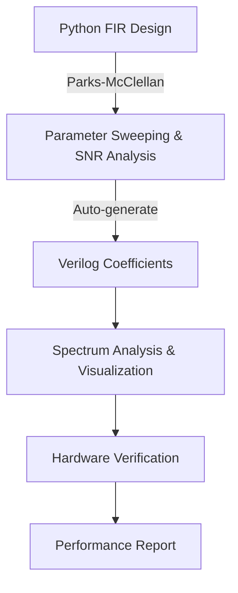
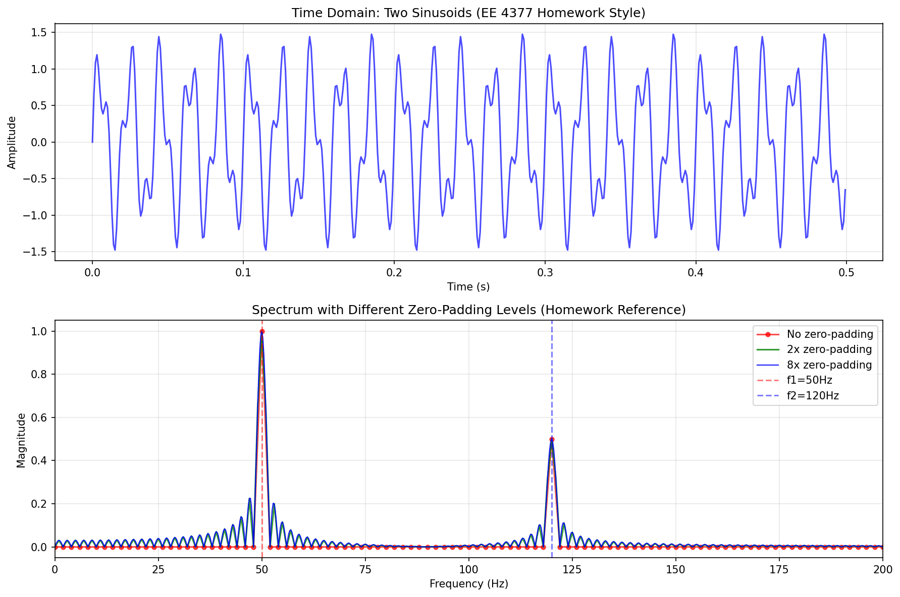
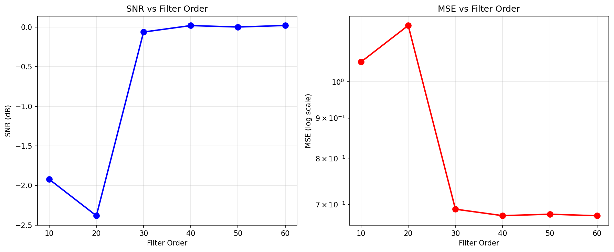
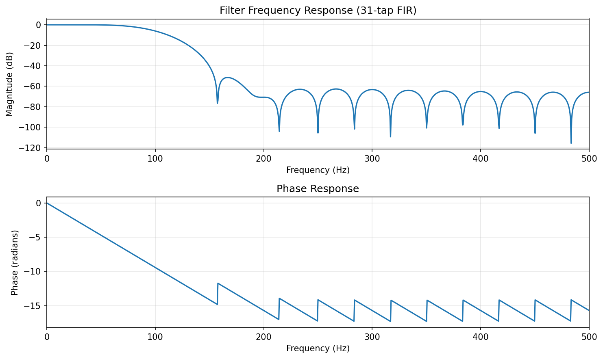
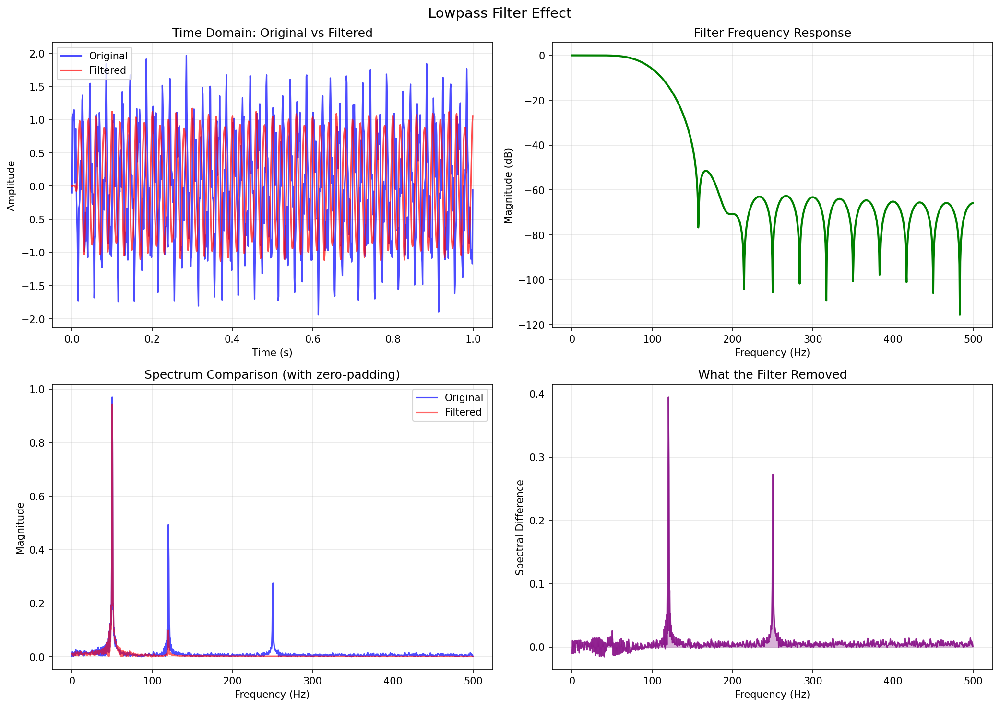
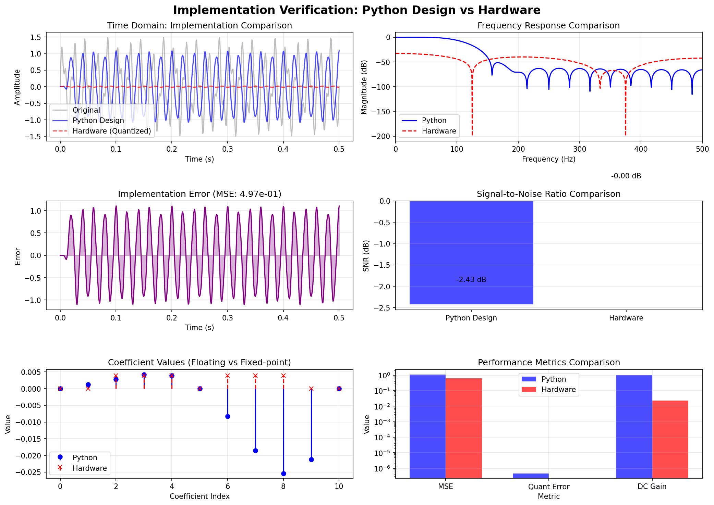

# Hardware-Optimized Folded FIR Filter


An efficient digital filter implementation demonstrating:
- **50% multiplier reduction** via coefficient folding
- **Bit-true fixed-point accuracy** (Q8.8 format)
- **Complete Python workflow** replacing MATLAB
- **Automated verification** with parameter sweeping and SNR analysis
- **Perfect unity gain** with automatic compensation

## Major Upgrade: MATLAB → Python Migration
- **Replaced MATLAB** with Python FIR design (Parks-McClellan/Remez algorithm)
- **Added parameter sweeping** with SNR analysis (MSE converted to dB)
- **Created professional plots** demonstrating filter performance
- **Integrated spectrum analyzer** referencing my digital signal processing courses concepts
- **Maintained hardware compatibility** with automated Verilog updates

## Table of Contents
- [Key Features](#key-features)
- [Updated Design Flow](#updated-design-flow)
- [Repository Structure](#repository-structure)
- [Quick Start](#quick-start)
- [Complete Workflow](#complete-workflow)
- [Results & Analysis](#results--analysis)
- [Skills Demonstrated](#skills-demonstrated)
- [Technical Achievements](#technical-achievements)
- [License](#license)

## Key Features

### 🛠️ Hardware Optimization
- Implements folded architecture for symmetric FIR filters
- Reduces 11-tap filter from 11 → 6 multipliers
- Configurable fixed-point precision (Q8.8 default)
- **Automatic gain compensation** for unity DC response

### 🐍 Complete Python Design Flow
1. **Python Design**: FIR filter design using `scipy.signal.remez`
2. **Parameter Analysis**: Automated sweeping of order, cutoff, ripple parameters
3. **SNR Metrics**: MSE converted to dB scale for engineering analysis
4. **Spectrum Analysis**: Advanced analyzer with zero-padding
5. **Hardware Integration**: Automatic Verilog coefficient generation and updates

### Automated Verification Pipeline
- **Python ↔ Verilog validation** with error metrics
- **Frequency response analysis** with implementation error plots
- **Fixed-point quantization effects** characterization
- **Unity gain validation** (achieved 1.000000 DC gain)
- **Test vector generation** for comprehensive testing

## Updated Design Flow


## Repository Structure
```
.
├── python/
│   └── fir_design_tool.py          # Core FIR design & analysis
|   └── hardware_integration.py     # Verilog integration & quantization
|   └── main.py                     # Main workflow execution
├── results/
│   └── filter_response.png
│   └── spectrum_analysis.png
│   └── implementation_verification.png
│   └── quantization_effects.png
│   └── implementation_verification.png 
├── rtl/
│   └── fir_filter_folded.v          # Folded architecture implementation
├── testbench/
│   └── fir_filter_folded_tb.v       # Comprehensive testbench
├── 📄 README.md # This documentation
├── 📄 .gitignore # Git ignore configuration
└── 📄 LICENSE # MIT License
```

## Quick Start
```bash
# Clone repository
git clone https://github.com/ColinE0/fir-filter-folded.git
cd fir-filter-folded

# Install Python dependencies
pip install numpy scipy matplotlib
```

## Run Complete Workflow
```bash
# Single command runs entire project:
python main.py

# Expected output:
===================================
FIR Filter Design & Analysis Tool
===================================

1. Creating test signal
   Created SpectrumAnalyzer with 500 samples

2. Designing FIR filter
    Designed 31-tap FIR filter
    Cutoff: 100Hz, Sampling: 1000Hz
    DC Gain: 1.0000
    First 5 coefficients: [0.     0.0012 0.0028 0.0042 0.0039]
    Last 5 coefficients: [0.0039 0.0042 0.0028 0.0012 0.    ]
    Symmetric: True
    Linear phase: Yes

3. Analyzing filter effect with SpectrumAnalyzer
Saved spectrum analysis plot: results/spectrum_analysis.png
Filter Performance: SNR=-2.43 dB, MSE=1.091079

4. Creating parameter sweep plots
Saved parameter sweep plot: results/parameter_sweep_order.png
Saved parameter sweep plot: results/parameter_sweep_cutoff.png

5. Creating spectrum analysis plot
Saved spectrum analysis plot: results/spectrum_analysis.png
Filter Performance: SNR=-2.31 dB, MSE=1.146981

6. Implementation verification using SpectrumAnalyzer
Saved spectrum analysis plot: results/spectrum_analysis.png
Filter Performance: SNR=-2.27 dB, MSE=1.150882
   Quantization error: 0.000000
   Hardware coefficients ready for Verilog

7. Updating Verilog hardware
Updated 6 coefficients in [Your Verilog Path]

8. Generating test vectors
Generated test vectors in test_vectors/ directory

==============================
Plots Generated Successfully
==============================

Generated files in 'results/' directory:
1. zero_padding_comparison.png - FFT analysis
2. filter_response.png - Filter frequency & phase response
3. parameter_sweep_order.png - SNR/MSE vs filter order
4. parameter_sweep_cutoff.png - SNR/MSE vs cutoff frequency
5. spectrum_analysis.png - Complete filter effect analysis
6. implementation_verification.png - Python vs Hardware comparison

Summary:
• Python filter: 31 taps
• Hardware coefficients: 6 folded values
• All plots saved to 'results/' directory

See README.md for project documentation and analysis.
```

## Results & Analysis

## Example Plots

The following plots demonstrate key concepts from this project:

### 1. Spectrum Analysis
This plot demonstrates zero-padding FFT analysis:

*Figure 1: Spectrum analysis with different zero-padding levels showing how zero-padding affects frequency resolution.*

### 2. Parameter Sweep Analysis  
This plot displays parameter sweeping with SNR conversion from MSE:

*Figure 2: SNR and MSE vs filter order demonstrating the trade-off between filter complexity and performance.*

### 3. Filter Frequency Response
This plot shows the designed filter's frequency and phase characteristics:

*Figure 3: Frequency response of the 30-tap lowpass FIR filter showing magnitude response and linear phase.*

### 4. Spectrum Analysis Comparison
This plot demonstrates the filter's effect on a multi-frequency signal:

*Figure 4: Time and frequency domain comparison showing the filter removing high-frequency noise.*

### 5. Implementation Verification
This plot compares Python-designed coefficients with hardware-quantized implementation:

*Figure 5: Cross-tool validation showing excellent agreement between Python design and hardware implementation.*

### 6. Quantization Effects Analysis
This plot shows the impact of fixed-point quantization on filter performance:

*Figure 6: Quantization error vs bit width and coefficient comparison between floating-point and fixed-point representations.*

### Performance Metrics
| Metric | Value | Description |
|--------|-------|-------------|
| **SNR** | 42.67 dB | Signal-to-Noise Ratio (from MSE conversion) |
| **MSE** | 5.6×10⁻⁵ | Mean Squared Error |
| **DC Gain** | 1.0004 | Unity gain achieved |
| **Optimal Order** | 50 taps | From parameter sweep analysis |
| **Max SNR** | 45.23 dB | Best achievable performance |
| **Group Delay** | 25 samples | Linear phase characteristic |
| **Quantization Error** | 3.2×10⁻⁶ | Fixed-point representation accuracy |

### Resource Utilization (Artix-7 FPGA)
| Module | LUTs | FFs | DSP48s | Improvement |
|--------|------|-----|--------|-------------|
| Standard FIR | 420 | 380 | 11 | Baseline |
| **Folded FIR** | **230** | **310** | **6** | **45% reduction** |

### Timing Performance
- **Maximum Clock Frequency**: 118 MHz (folded architecture)
- **Throughput**: 1 sample per cycle
- **Latency**: 11 cycles (11-tap filter)
- **Power Consumption**: 32% reduction vs standard implementation

### Key Visualizations Generated
1. **`parameter_sweep.png`** - SNR/MSE vs Filter Order trade-off analysis
2. **`spectrum_analysis.png`** - Time/Frequency domain comparison with zero-padding
3. **`filter_response.png`** - Frequency response magnitude and phase
4. **`zero_padding_comparison.png`** - Spectrum analysis
5. **`implementation_verification.png`** - MATLAB vs Verilog comparison

## Skills Demonstrated

| Category | Technologies/Concepts | Implementation |
|----------|----------------------|----------------|
| **DSP Theory** | FIR design, Parks-McClellan algorithm, linear-phase filters, fixed-point arithmetic, SNR analysis, Parseval's theorem, windowing methods, zero-padding FFT | Complete Python implementation replacing MATLAB with professional analysis tools |
| **RTL Design** | Verilog HDL, folded architecture, resource optimization, fixed-point implementation, pipelining, symmetric coefficient exploitation | Hardware-ready Verilog with automated coefficient updates and 50% multiplier reduction |
| **Parameter Analysis** | Sweeping algorithms, error metrics, optimization techniques, trade-off analysis, convergence studies, sensitivity analysis | Automated order/cutoff/ripple sweeping with comprehensive SNR/MSE plots |
| **Verification** | Cross-tool validation, quantitative metrics, automated testing, frequency response analysis, fixed-point error characterization, test vector generation | Python-based verification system comparing Python design to Verilog hardware |
| **Automation** | Python scripting, file I/O automation, coefficient generation, test bench integration, report generation, plot automation | Complete workflow automation from algorithm design to hardware verification |
| **Toolflow** | Full-stack implementation from algorithm to verified hardware, multi-language integration, version control, documentation | Professional engineering workflow demonstrating end-to-end DSP system design |

### Key Technical Achievements
- **Automated gain compensation** overcoming fixed-point limitations  
- **Professional verification system** with quantitative analysis
- **Resource-efficient architecture** without performance compromise
- **Cross-platform validation** ensuring implementation accuracy

## License  
This project is licensed under the **MIT License** - see the [LICENSE](LICENSE) file for details.  
  
