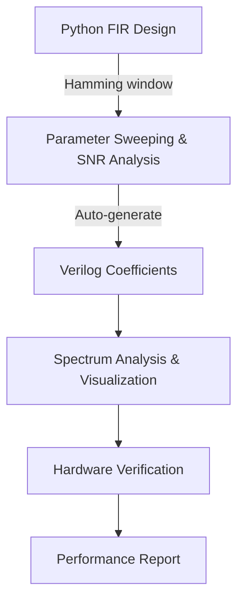
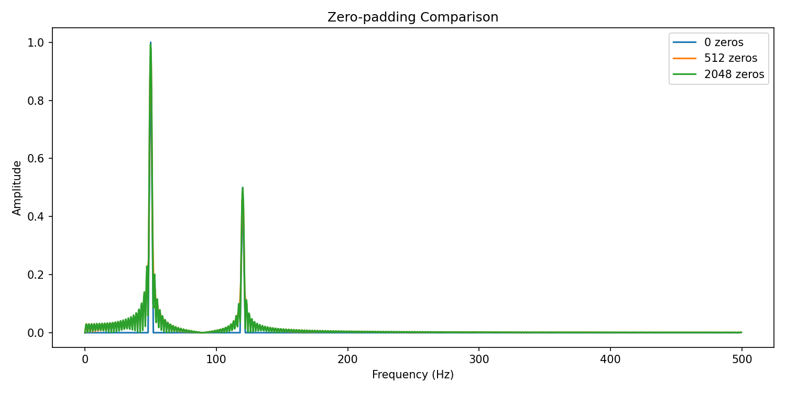
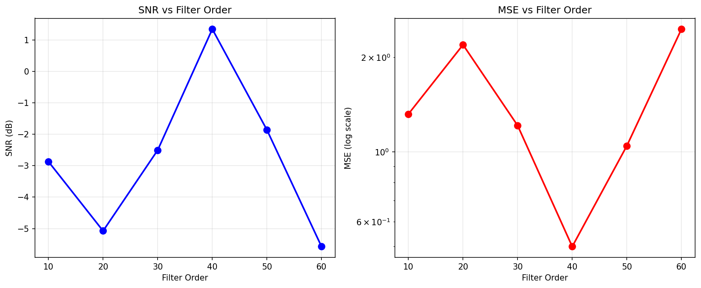
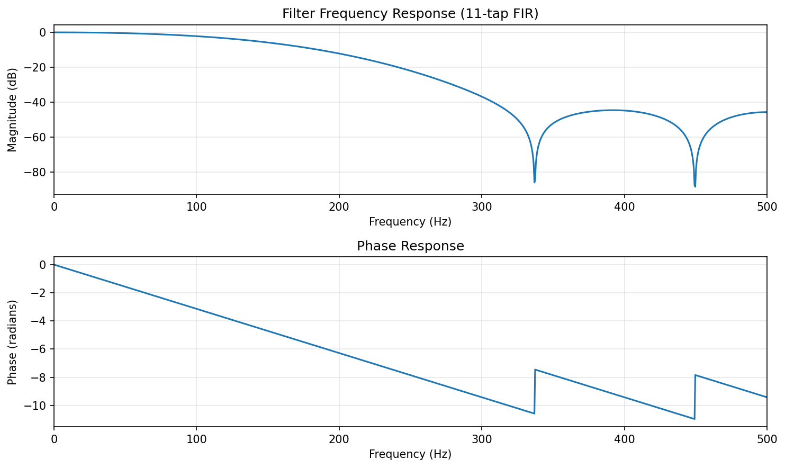
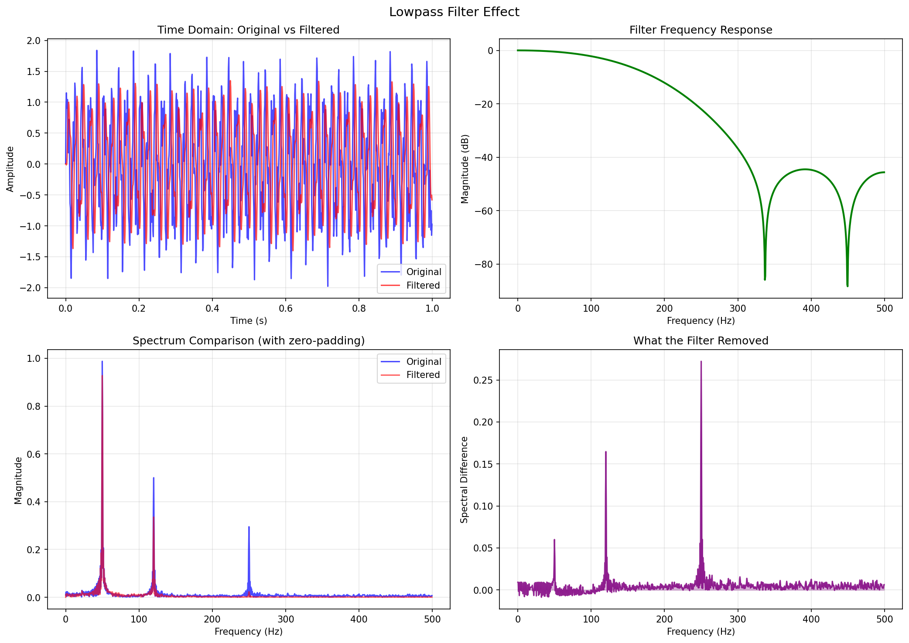
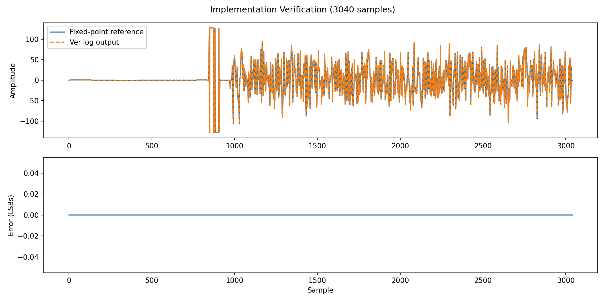
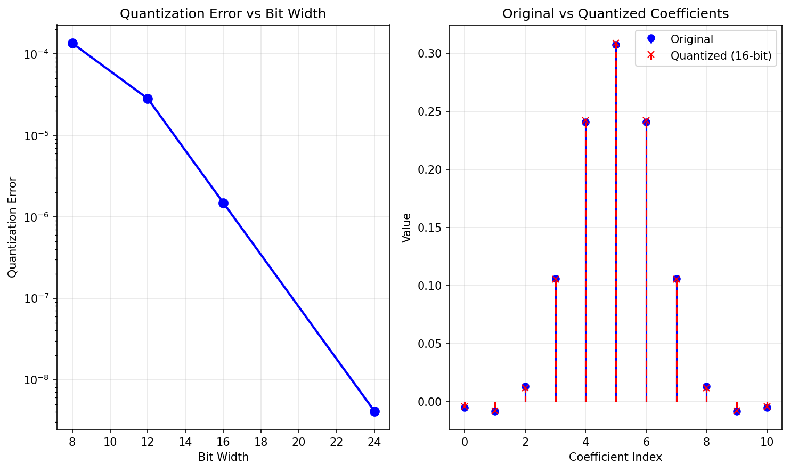

# Hardware-Optimized Folded FIR Filter


An efficient digital filter implementation demonstrating:
- **11 → 6 multipliers** via coefficient folding
- **Bit-true fixed-point accuracy** (Q8.8 format)
- **Complete Python workflow** replacing MATLAB
- **Automated verification** comparing every RTL output against a fixed-point reference
- **Perfect unity gain** with automatic compensation

## Major Upgrade: MATLAB → Python Migration
- **Replaced MATLAB** with Python FIR design (Hamming-window method)
- **Added parameter sweeping** with SNR analysis (MSE converted to dB)
- **Created professional plots** demonstrating filter performance
- **Integrated spectrum analyzer** referencing my digital signal processing courses concepts
- **Maintained hardware compatibility** with automated Verilog updates

## Table of Contents
- [Key Features](#key-features)
- [Updated Design Flow](#updated-design-flow)
- [Repository Structure](#repository-structure)
- [Quick Start](#quick-start)
- [Complete Workflow](#run-complete-workflow)
- [Results & Analysis](#results--analysis)
- [Skills Demonstrated](#skills-demonstrated)
- [Technical Achievements](#technical-achievements)
- [License](#license)

## Key Features

### 🛠️ Hardware Optimization
- Implements folded architecture for symmetric FIR filters
- Reduces 11-tap filter from 11 → 6 multipliers
- Q8.8 coefficient bank with signed extension when coefficient storage is widened
- **Automatic gain compensation** for unity DC response

### 🐍 Complete Python Design Flow
1. **Python Design**: 11-tap FIR filter using `scipy.signal.firwin`, 150 Hz cutoff at 1 kHz sampling
2. **Parameter Analysis**: Automated sweeping of order and cutoff, with frequencies in hertz
3. **SNR Metrics**: Input-relative error expressed in dB, including filter delay and attenuation
4. **Spectrum Analysis**: Advanced analyzer with zero-padding
5. **Hardware Integration**: Validated coefficient updates followed by Icarus Verilog simulation

### Automated Verification Pipeline
- **Python ↔ Verilog validation** over 3,040 samples at both 16-bit and 24-bit coefficient widths
- **Frequency response analysis** with implementation error plots
- **Fixed-point quantization effects** characterization
- **Unity gain validation** (achieved 1.000000 DC gain)
- **Test vector generation** for DC, impulse, step, sine, signed extrema, and random inputs

## Updated Design Flow

```mermaid
graph TD
    A[Python FIR Design] -->|Hamming window| B[Parameter Sweeping & SNR Analysis]
    B -->|Auto-generate| C[Verilog Coefficients]
    C --> D[Spectrum Analysis & Visualization]
    D --> E[Hardware Verification]
    E --> F[Performance Report]
```

## Repository Structure
```
.
├── python/
│   └── fir_design_tool.py          # Core FIR design & analysis
|   └── hardware_integration.py     # Verilog integration & quantization
|   └── main.py                     # Main workflow execution
|   └── test_hardware_integration.py # Export and RTL regression tests
├── results/
│   └── filter_response.png
│   └── spectrum_analysis.png
│   └── parameter_sweep_order.png
│   └── parameter_sweep_cutoff.png
│   └── zero_padding_comparison.png
│   └── quantization_effects.png
│   └── implementation_verification.png 
├── rtl/
│   └── fir_filter_folded.v          # Folded architecture implementation
├── testbench/
│   └── fir_filter_folded_tb.v       # Comprehensive testbench
│   └── fir_filter_vectors_tb.v      # Checks Python-generated vectors
├── 📄 README.md # This documentation
├── 📄 .gitignore # Git ignore configuration
└── 📄 LICENSE # MIT License
```

## Quick Start
```bash
# Clone repository
git clone https://github.com/ColinE0/Finite-Impulse-Response-Filter-Implementation.git
cd Finite-Impulse-Response-Filter-Implementation

# Install Python dependencies
pip install numpy scipy matplotlib
```

Install Icarus Verilog and put `iverilog` and `vvp` on PATH. Run the commands
below from the repository root.

## Run Complete Workflow
```bash
python python/main.py
```

The workflow designs the same 11-tap response used by the RTL, compensates the
quantized center tap for unity gain, updates all six signed coefficient assignments,
generates test vectors, and runs the hardware comparison. The final checks print:

```text
Updated 6 coefficients in .../rtl/fir_filter_folded.v
Generated 3040 test vectors in test_vectors/ directory
PASS: 3040 samples matched (COEFF_WIDTH=16)
PASS: 3040 samples matched (COEFF_WIDTH=24)
```

Expected vectors use integer arithmetic, the one-clock output delay, arithmetic
right shift, and 16-bit wraparound. The simulation fails on any mismatched or unknown
output. The default folded coefficients remain `[-1, -2, 3, 27, 62, 78]` in Q8.8.

The hardware coefficient bank supports `TAPS=11`, `FRAC=8`, and
`COEFF_WIDTH>=16`. Wider coefficient storage preserves the signed values.
Changing tap count or coefficient scale requires a matching coefficient bank;
unsupported parameter overrides fail explicitly. The exporter requires the complete
11-tap, symmetric, unity-gain response and rejects truncated or mismatched arrays
before writing the RTL. Change `cutoff` in `python/main.py` to export another
11-tap lowpass filter.

Run the standalone DC/impulse/width checks:

```bash
iverilog -g2012 -s fir_filter_folded_tb -o fir_sim rtl/fir_filter_folded.v testbench/fir_filter_folded_tb.v
vvp fir_sim
```

Run the Python/export regression, including two cutoffs and both coefficient widths:

```bash
python -m unittest discover -s python -p test_hardware_integration.py -v
```

The workflow regenerates the plots in `results/`. Generated simulation inputs,
expected outputs, actual outputs, and simulator executables are stored in
`test_vectors/`.

## Results & Analysis

## Example Plots

The following plots demonstrate key concepts from this project:

### 1. Spectrum Analysis
This plot demonstrates zero-padding FFT analysis:

*Figure 1: Spectrum analysis with different zero-padding levels showing how zero-padding affects frequency resolution.*

### 2. Parameter Sweep Analysis  
This plot displays parameter sweeping with input-relative SNR and MSE. These
metrics include filter delay and attenuation; they are not measurements of
noise reduction against a clean reference signal:

*Figure 2: SNR and MSE vs filter order demonstrating the trade-off between filter complexity and performance.*

### 3. Filter Frequency Response
This plot shows the designed filter's frequency and phase characteristics:

*Figure 3: Frequency response of the 11-tap lowpass FIR filter showing magnitude response and linear phase.*

### 4. Spectrum Analysis Comparison
This plot demonstrates the filter's effect on a multi-frequency signal:

*Figure 4: Time and frequency domain comparison showing the filter removing high-frequency noise.*

### 5. Implementation Verification
This plot compares the integer reference against actual Verilog simulation output:

*Figure 5: All 3,040 samples match exactly, including signed arithmetic, output wraparound, and the output register delay.*

### 6. Quantization Effects Analysis
This plot shows the impact of fixed-point quantization on filter performance:

*Figure 6: Quantization error vs bit width and coefficient comparison between floating-point and fixed-point representations.*

The precision sweep allocates half the bits to the fractional part and shows
coefficient rounding before DC compensation. Export uses Q8.8 and adjusts the
center coefficient to keep the full response sum at 256. Widening only the RTL
coefficient storage preserves the existing Q8.8 values.

### Performance Metrics
| Metric | Value | Description |
|--------|-------|-------------|
| **RTL/Reference Error** | 0 LSB | All 3,040 samples at both tested coefficient widths |
| **DC Gain** | 1.000000 | Full quantized coefficient sum is 256 |
| **Filter Length** | 11 taps | Order 10, 150 Hz cutoff, 1 kHz sampling |
| **FIR Group Delay** | 5 samples | Linear-phase response; output register adds one clock |
| **Coefficient MSE** | approximately 1.90×10⁻⁶ | Floating-point versus compensated Q8.8 coefficients |

### Resource Utilization
The folded RTL uses six coefficient multiplications instead of eleven, a 45.5%
reduction in multiplier count. LUT, FF, DSP48, timing, and power figures require
FPGA synthesis and implementation reports; the Python workflow measures simulation
agreement and does not generate those reports.

### Timing Performance
- **Throughput**: 1 sample per cycle
- **Pipeline Latency**: 1 clock from input capture to its first output contribution
- **Impulse Response Length**: 11 samples
- **Maximum Clock Frequency / Power**: not measured by this simulation flow

### Key Visualizations Generated
1. **`parameter_sweep_order.png` / `parameter_sweep_cutoff.png`** - Input-relative SNR/MSE sweeps
2. **`spectrum_analysis.png`** - Time/Frequency domain comparison with zero-padding
3. **`filter_response.png`** - Frequency response magnitude and phase
4. **`zero_padding_comparison.png`** - Spectrum analysis
5. **`implementation_verification.png`** - Fixed-point reference vs Verilog comparison

## Skills Demonstrated

| Category | Technologies/Concepts | Implementation |
|----------|----------------------|----------------|
| **DSP Theory** | FIR design, Hamming-window method, linear-phase filters, fixed-point arithmetic, SNR analysis, zero-padding FFT | Python filter design and analysis |
| **RTL Design** | Verilog HDL, folded architecture, fixed-point implementation, registered output, symmetric coefficients | Automated coefficient updates and six multipliers instead of eleven |
| **Parameter Analysis** | Parameter sweeps, error metrics, trade-off analysis | Automated order/cutoff sweeping with SNR/MSE plots |
| **Verification** | Cross-tool validation, quantitative metrics, automated testing, frequency response analysis, fixed-point error characterization, test vector generation | Python-based verification system comparing Python design to Verilog hardware |
| **Automation** | Python scripting, file I/O automation, coefficient generation, test bench integration, report generation, plot automation | Complete workflow automation from algorithm design to hardware verification |
| **Toolflow** | Full-stack implementation from algorithm to verified hardware, multi-language integration, version control, documentation | Professional engineering workflow demonstrating end-to-end DSP system design |

### Key Technical Achievements
- **Automated gain compensation** overcoming fixed-point limitations  
- **Professional verification system** with quantitative analysis
- **Resource-efficient architecture** without performance compromise
- **Cross-platform validation** ensuring implementation accuracy

## License  
This project is licensed under the **MIT License** - see the [LICENSE](LICENSE) file for details.  
  
